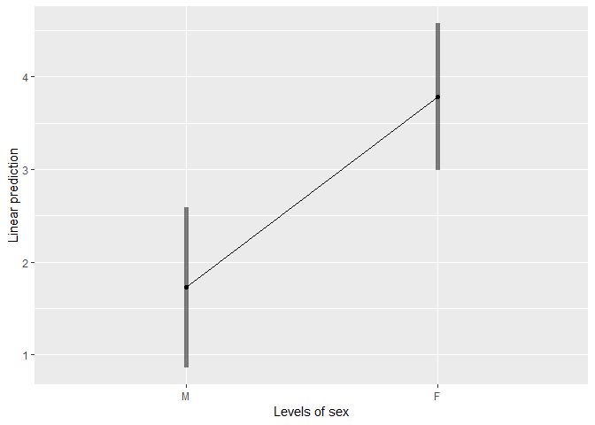
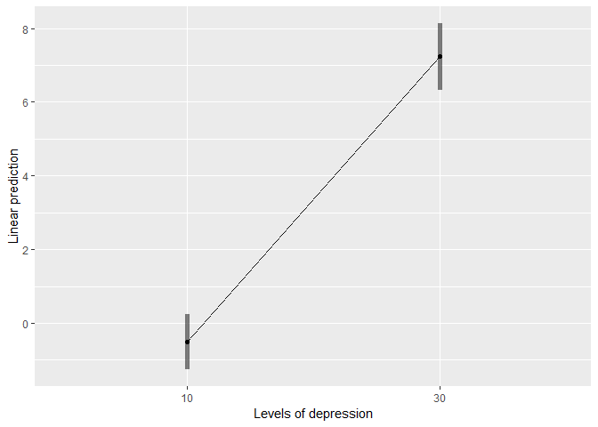

Simple slopes
================

Import data
-----------

The data in anxiety is from a hypothetical correlational design, where anxiety, depression and sex can be used to predict some outcome.
The sav file has the following variables:

-   anxiety - score between 0-60 of anxiety symptoms.
-   depression - score between 0-40 of depression symptoms.
-   sex - 1 = male, 2 = female
-   outcome - score between 0-35 of some outcome

``` r
library(tidyverse)
```

    ## -- Attaching packages ------------------------------------------------------------------- tidyverse 1.2.1 --

    ## v ggplot2 3.0.0     v purrr   0.2.5
    ## v tibble  1.4.2     v dplyr   0.7.6
    ## v tidyr   0.8.1     v stringr 1.3.1
    ## v readr   1.1.1     v forcats 0.3.0

    ## -- Conflicts ---------------------------------------------------------------------- tidyverse_conflicts() --
    ## x dplyr::filter() masks stats::filter()
    ## x dplyr::lag()    masks stats::lag()

``` r
library(haven)
```

    ## Warning: package 'haven' was built under R version 3.5.1

``` r
# import data
df_outcome <- read_spss("data/anxiety.sav") %>% 
  mutate(sex = factor(sex,labels = c("M","F")),
         anxiety = scale(anxiety))
```

Interaction with binary var
---------------------------

``` r
library(lm.beta) # for standerdized coeffs

fit_1 <- lm(outcome ~ anxiety+sex, df_outcome)
summary(lm.beta(fit_1))
```

    ## 
    ## Call:
    ## lm(formula = outcome ~ anxiety + sex, data = df_outcome)
    ## 
    ## Residuals:
    ##      Min       1Q   Median       3Q      Max 
    ## -11.3654  -2.8431  -0.1225   2.2733  13.6702 
    ## 
    ## Coefficients:
    ##             Estimate Standardized Std. Error t value Pr(>|t|)    
    ## (Intercept) 11.53398      0.00000    0.43763  26.356   <2e-16 ***
    ## anxiety      2.84773      0.57142    0.30437   9.356   <2e-16 ***
    ## sexF         0.47552      0.04778    0.60781   0.782    0.435    
    ## ---
    ## Signif. codes:  0 '***' 0.001 '**' 0.01 '*' 0.05 '.' 0.1 ' ' 1
    ## 
    ## Residual standard error: 4.079 on 182 degrees of freedom
    ## Multiple R-squared:  0.3372, Adjusted R-squared:  0.3299 
    ## F-statistic:  46.3 on 2 and 182 DF,  p-value: < 2.2e-16

``` r
fit_2 <- lm(outcome ~ anxiety*sex, df_outcome)
summary(fit_2)
```

    ## 
    ## Call:
    ## lm(formula = outcome ~ anxiety * sex, data = df_outcome)
    ## 
    ## Residuals:
    ##      Min       1Q   Median       3Q      Max 
    ## -12.8074  -2.4492  -0.1874   1.7965  17.3147 
    ## 
    ## Coefficients:
    ##              Estimate Std. Error t value Pr(>|t|)    
    ## (Intercept)   11.3538     0.4282  26.517  < 2e-16 ***
    ## anxiety        1.7288     0.4380   3.947 0.000113 ***
    ## sexF           0.5190     0.5904   0.879 0.380529    
    ## anxiety:sexF   2.0548     0.5935   3.462 0.000669 ***
    ## ---
    ## Signif. codes:  0 '***' 0.001 '**' 0.01 '*' 0.05 '.' 0.1 ' ' 1
    ## 
    ## Residual standard error: 3.962 on 181 degrees of freedom
    ## Multiple R-squared:  0.3784, Adjusted R-squared:  0.3681 
    ## F-statistic: 36.72 on 3 and 181 DF,  p-value: < 2.2e-16

``` r
# compare F+ test
anova(fit_1,fit_2)
```

    ## Analysis of Variance Table
    ## 
    ## Model 1: outcome ~ anxiety + sex
    ## Model 2: outcome ~ anxiety * sex
    ##   Res.Df    RSS Df Sum of Sq      F    Pr(>F)    
    ## 1    182 3028.9                                  
    ## 2    181 2840.8  1    188.12 11.986 0.0006689 ***
    ## ---
    ## Signif. codes:  0 '***' 0.001 '**' 0.01 '*' 0.05 '.' 0.1 ' ' 1

``` r
# Simple slopes -----

library(emmeans)

rg <- emtrends(fit_2, ~sex, var = "anxiety")
rg
```

    ##  sex anxiety.trend        SE  df  lower.CL upper.CL
    ##  M        1.728824 0.4379706 181 0.8646393 2.593009
    ##  F        3.783595 0.4005489 181 2.9932494 4.573941
    ## 
    ## Confidence level used: 0.95

``` r
emmip(rg,~sex, CIs = TRUE)
```



``` r
contrast(rg,"pairwise")
```

    ##  contrast  estimate       SE  df t.ratio p.value
    ##  M - F    -2.054771 0.593513 181  -3.462  0.0007

``` r
test(rg)
```

    ##  sex anxiety.trend        SE  df t.ratio p.value
    ##  M        1.728824 0.4379706 181   3.947  0.0001
    ##  F        3.783595 0.4005489 181   9.446  <.0001

Interaction with continous var
------------------------------

``` r
fit_1 <- lm(outcome ~ anxiety+depression, df_outcome)
summary(fit_1)
```

    ## 
    ## Call:
    ## lm(formula = outcome ~ anxiety + depression, data = df_outcome)
    ## 
    ## Residuals:
    ##      Min       1Q   Median       3Q      Max 
    ## -10.7674  -2.8027  -0.0719   2.4303  12.5717 
    ## 
    ## Coefficients:
    ##             Estimate Std. Error t value Pr(>|t|)    
    ## (Intercept) 10.85689    0.80075  13.558   <2e-16 ***
    ## anxiety      2.85497    0.30089   9.488   <2e-16 ***
    ## depression   0.05347    0.04287   1.247    0.214    
    ## ---
    ## Signif. codes:  0 '***' 0.001 '**' 0.01 '*' 0.05 '.' 0.1 ' ' 1
    ## 
    ## Residual standard error: 4.069 on 182 degrees of freedom
    ## Multiple R-squared:  0.3406, Adjusted R-squared:  0.3334 
    ## F-statistic: 47.01 on 2 and 182 DF,  p-value: < 2.2e-16

``` r
fit_2 <- lm(outcome ~ anxiety*depression, df_outcome)
summary(fit_2)
```

    ## 
    ## Call:
    ## lm(formula = outcome ~ anxiety * depression, data = df_outcome)
    ## 
    ## Residuals:
    ##     Min      1Q  Median      3Q     Max 
    ## -7.9582 -2.1388 -0.0982  2.2151  7.3930 
    ## 
    ## Coefficients:
    ##                    Estimate Std. Error t value Pr(>|t|)    
    ## (Intercept)        11.22209    0.61847  18.145  < 2e-16 ***
    ## anxiety            -4.36002    0.68594  -6.356 1.63e-09 ***
    ## depression          0.02020    0.03320   0.609    0.544    
    ## anxiety:depression  0.38635    0.03456  11.178  < 2e-16 ***
    ## ---
    ## Signif. codes:  0 '***' 0.001 '**' 0.01 '*' 0.05 '.' 0.1 ' ' 1
    ## 
    ## Residual standard error: 3.138 on 181 degrees of freedom
    ## Multiple R-squared:  0.6099, Adjusted R-squared:  0.6034 
    ## F-statistic: 94.32 on 3 and 181 DF,  p-value: < 2.2e-16

``` r
anova(fit_1,fit_2)
```

    ## Analysis of Variance Table
    ## 
    ## Model 1: outcome ~ anxiety + depression
    ## Model 2: outcome ~ anxiety * depression
    ##   Res.Df    RSS Df Sum of Sq      F    Pr(>F)    
    ## 1    182 3013.3                                  
    ## 2    181 1782.7  1    1230.6 124.94 < 2.2e-16 ***
    ## ---
    ## Signif. codes:  0 '***' 0.001 '**' 0.01 '*' 0.05 '.' 0.1 ' ' 1

``` r
# Simple slopes ----
rg <- emtrends(fit_2, ~depression, var = "anxiety")
rg
```

    ##  depression anxiety.trend        SE  df lower.CL upper.CL
    ##    17.32643      2.334035 0.2367101 181 1.866969 2.801101
    ## 
    ## Confidence level used: 0.95

``` r
rg <- emtrends(fit_2, ~depression, var = "anxiety", at = list(depression = c(10,30)))
rg
```

    ##  depression anxiety.trend        SE  df  lower.CL  upper.CL
    ##          10    -0.4965283 0.3791615 181 -1.244674 0.2516169
    ##          30     7.2304613 0.4550749 181  6.332527 8.1283956
    ## 
    ## Confidence level used: 0.95

``` r
emmip(rg,~depression, CIs = TRUE)
```



``` r
contrast(rg,"pairwise")
```

    ##  contrast estimate        SE  df t.ratio p.value
    ##  10 - 30  -7.72699 0.6912902 181 -11.178  <.0001

``` r
test(rg)
```

    ##  depression anxiety.trend        SE  df t.ratio p.value
    ##          10    -0.4965283 0.3791615 181  -1.310  0.1920
    ##          30     7.2304613 0.4550749 181  15.889  <.0001
