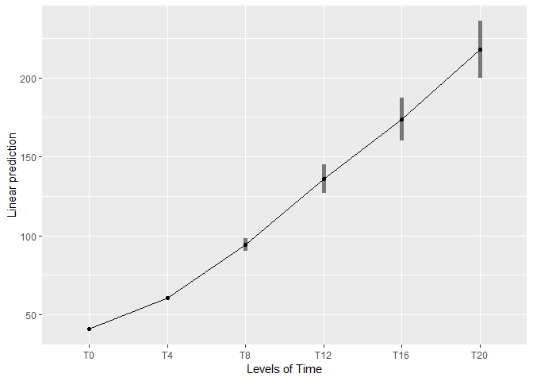
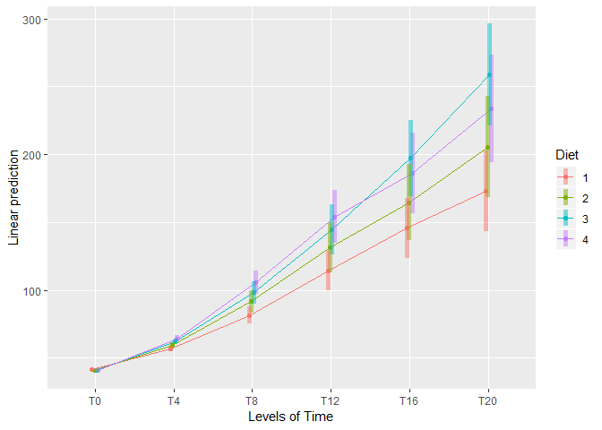

ANOVA
================

## Import data

ChickWeight data describes a mixed design: a group of 45 chickens were
split into 4 groups, each group was given a different diet. Each chick
was weighed at 6 time points (4 week intervals).  
The sav file has the following variables:

  - Chick - the chich ID
  - Diet - 1-4 the Diet number, with 1 being the standard diet.
  - T0:T20 - weigts at each of the 6 time points.

<!-- end list -->

``` r
library(haven)

# import wide format
df_wide <- read_spss('data/ChickWeight.sav')

head(df_wide)
```

    ## # A tibble: 6 x 8
    ##       Chick      Diet    T0    T4    T8   T12   T16   T20
    ##   <dbl+lbl> <dbl+lbl> <dbl> <dbl> <dbl> <dbl> <dbl> <dbl>
    ## 1    4 [13]     1 [1]    41    53    65    71    71    91
    ## 2    5 [9]      1 [1]    42    59    85    90    93   100
    ## 3    6 [20]     1 [1]    41    54    65    77    98   115
    ## 4    7 [10]     1 [1]    41    52    74    89   101   120
    ## 5    9 [17]     1 [1]    42    61    83    98   113   133
    ## 6   10 [19]     1 [1]    43    55    65    82   106   144

We need the data in the long format:

``` r
library(tidyverse)

df_long <- df_wide %>% 
  gather("Time","weight",T0:T20)


head(df_long)
```

    ## # A tibble: 6 x 4
    ##       Chick      Diet Time  weight
    ##   <dbl+lbl> <dbl+lbl> <chr>  <dbl>
    ## 1    4 [13]     1 [1] T0        41
    ## 2    5 [9]      1 [1] T0        42
    ## 3    6 [20]     1 [1] T0        41
    ## 4    7 [10]     1 [1] T0        41
    ## 5    9 [17]     1 [1] T0        42
    ## 6   10 [19]     1 [1] T0        43

## repeated measure ANOVA

We will fit a mixed-anova model with `afex`:

``` r
library(afex)

# fit using `aov_ez`
fit <- aov_ez(id = "Chick", dv = "weight", data = df_long,
              between = c("Diet"), within = "Time")
fit
```

    ## Anova Table (Type 3 tests)
    ## 
    ## Response: weight
    ##      Effect          df     MSE          F ges p.value
    ## 1      Diet       3, 41 3147.91    5.08 ** .15    .004
    ## 2      Time 1.25, 51.43 2587.62 304.91 *** .79  <.0001
    ## 3 Diet:Time 3.76, 51.43 2587.62    3.84 ** .12    .010
    ## ---
    ## Signif. codes:  0 '***' 0.001 '**' 0.01 '*' 0.05 '+' 0.1 ' ' 1
    ## 
    ## Sphericity correction method: GG

We can change some of the defults, such as \(\eta^2_2\) for
effect-sizes, and not correcting for GG:

``` r
fit <- aov_ez(id = "Chick", dv = "weight", data = df_long,
              between = "Diet", within = "Time",
              anova_table = list(es = "pes", correction = "none"))
fit
```

    ## Anova Table (Type 3 tests)
    ## 
    ## Response: weight
    ##      Effect      df     MSE          F pes p.value
    ## 1      Diet   3, 41 3147.91    5.08 ** .27    .004
    ## 2      Time  5, 205  649.18 304.91 *** .88  <.0001
    ## 3 Diet:Time 15, 205  649.18   3.84 *** .22  <.0001
    ## ---
    ## Signif. codes:  0 '***' 0.001 '**' 0.01 '*' 0.05 '+' 0.1 ' ' 1

## Contrasts

Before running contrasts in `emmeans`, we need to set some of `afex`
options, to ensure that MSE and DF for between-subject contrasts are
computed/estimated using the multivariate method (producing the same
results as SPSS ans Statistica):

``` r
afex_options(emmeans_model = "multivariate")
```

`emmeans` gives you much control over how contrasts are calculated.  
But… with great power comes great responsibility… (This is probably true
for most anything in R)

### simple effects

``` r
library(emmeans)  

joint_tests(fit, by = 'Diet')
```

    ## Diet = 1:
    ##  model term df1 df2 F.ratio p.value
    ##  Time         5  41  79.635 <.0001 
    ## 
    ## Diet = 2:
    ##  model term df1 df2 F.ratio p.value
    ##  Time         5  41  82.338 <.0001 
    ## 
    ## Diet = 3:
    ##  model term df1 df2 F.ratio p.value
    ##  Time         5  41 108.788 <.0001 
    ## 
    ## Diet = 4:
    ##  model term df1 df2 F.ratio p.value
    ##  Time         5  41 115.770 <.0001

``` r
joint_tests(fit, by = 'Time')
```

    ## Time = T0:
    ##  model term df1 df2 F.ratio p.value
    ##  Diet         3  41   1.697 0.1826 
    ## 
    ## Time = T4:
    ##  model term df1 df2 F.ratio p.value
    ##  Diet         3  41  13.538 <.0001 
    ## 
    ## Time = T8:
    ##  model term df1 df2 F.ratio p.value
    ##  Diet         3  41   7.788 0.0003 
    ## 
    ## Time = T12:
    ##  model term df1 df2 F.ratio p.value
    ##  Diet         3  41   4.291 0.0101 
    ## 
    ## Time = T16:
    ##  model term df1 df2 F.ratio p.value
    ##  Diet         3  41   3.355 0.0279 
    ## 
    ## Time = T20:
    ##  model term df1 df2 F.ratio p.value
    ##  Diet         3  41   4.918 0.0052

### Simple plot (at a glance)

``` r
emmip(fit, ~Time, CIs = TRUE)
```

<!-- -->

### compute contrasts with `contrast`

We first look create a refernce grid (which we can print to look at the
predicted means):

``` r
em_time <- emmeans(fit, ~Time)
em_time
```

    ##  Time emmean   SE df lower.CL upper.CL
    ##  T0     41.0 0.17 41     40.6     41.3
    ##  T4     60.8 0.48 41     59.8     61.8
    ##  T8     94.4 1.97 41     90.4     98.4
    ##  T12   136.1 4.44 41    127.1    145.0
    ##  T16   173.5 6.72 41    159.9    187.1
    ##  T20   217.9 8.96 41    199.8    236.0
    ## 
    ## Results are averaged over the levels of: Diet 
    ## Confidence level used: 0.95

Using some methods that come baked into `emmeans`:

``` r
contrast(em_time, "poly")
```

    ##  contrast  estimate    SE df t.ratio p.value
    ##  linear      1264.5 66.27 41 19.081  <.0001 
    ##  quadratic    138.4 27.96 41  4.949  <.0001 
    ##  cubic        -71.1 23.23 41 -3.063  0.0039 
    ##  quartic       16.9  3.67 41  4.609  <.0001 
    ##  degree 5      30.1  8.26 41  3.638  0.0008 
    ## 
    ## Results are averaged over the levels of: Diet

``` r
contrast(em_time, "consec") # using built in methods, emmeans knows when contrasts are dependant
```

    ##  contrast  estimate    SE df t.ratio p.value
    ##  T4 - T0       19.8 0.479 41 41.305  <.0001 
    ##  T8 - T4       33.6 1.710 41 19.652  <.0001 
    ##  T12 - T8      41.7 2.771 41 15.039  <.0001 
    ##  T16 - T12     37.4 3.062 41 12.229  <.0001 
    ##  T20 - T16     44.4 3.644 41 12.186  <.0001 
    ## 
    ## Results are averaged over the levels of: Diet 
    ## P value adjustment: mvt method for 5 tests

``` r
contrast(em_time, "consec", adjust = "fdr") # or adjust = "tukey"
```

    ##  contrast  estimate    SE df t.ratio p.value
    ##  T4 - T0       19.8 0.479 41 41.305  <.0001 
    ##  T8 - T4       33.6 1.710 41 19.652  <.0001 
    ##  T12 - T8      41.7 2.771 41 15.039  <.0001 
    ##  T16 - T12     37.4 3.062 41 12.229  <.0001 
    ##  T20 - T16     44.4 3.644 41 12.186  <.0001 
    ## 
    ## Results are averaged over the levels of: Diet 
    ## P value adjustment: fdr method for 5 tests

``` r
contrast(em_time, "consec", adjust = "none")
```

    ##  contrast  estimate    SE df t.ratio p.value
    ##  T4 - T0       19.8 0.479 41 41.305  <.0001 
    ##  T8 - T4       33.6 1.710 41 19.652  <.0001 
    ##  T12 - T8      41.7 2.771 41 15.039  <.0001 
    ##  T16 - T12     37.4 3.062 41 12.229  <.0001 
    ##  T20 - T16     44.4 3.644 41 12.186  <.0001 
    ## 
    ## Results are averaged over the levels of: Diet

We can also make custom methods. I will demonstrate here a simple
method, by you can [read more about creating more advanced
methods](https://cran.r-project.org/web/packages/emmeans/vignettes/comparisons.html#linfcns):

``` r
time_contrasts.emmc <- function(...){
  data.frame(
    half_time = c(-1,-1,-1,1,1,1)/3, # divide to get un-inflated estimate (has no effect on testing)
    start_end = c(-1,0,0,0,0,1)
  )
}

contrast(em_time, "time_contrasts")
```

    ##  contrast  estimate   SE df t.ratio p.value
    ##  half_time      110 5.94 41 18.585  <.0001 
    ##  start_end      177 9.00 41 19.661  <.0001 
    ## 
    ## Results are averaged over the levels of: Diet

## Interactions

We can do the same for interactions:

``` r
emmip(fit, Diet~Time, CIs = T)
```

<!-- -->

``` r
em_interaction <- emmeans(fit, ~ Diet * Time)
em_interaction
```

    ##  Diet Time emmean     SE df lower.CL upper.CL
    ##  1    T0     41.6  0.278 41     41.0     42.1
    ##  2    T0     40.7  0.351 41     40.0     41.4
    ##  3    T0     40.8  0.351 41     40.1     41.5
    ##  4    T0     40.9  0.370 41     40.1     41.6
    ##  1    T4     56.7  0.786 41     55.1     58.3
    ##  2    T4     59.8  0.994 41     57.8     61.8
    ##  3    T4     62.2  0.994 41     60.2     64.2
    ##  4    T4     64.4  1.047 41     62.3     66.6
    ##  1    T8     81.6  3.222 41     75.1     88.1
    ##  2    T8     91.7  4.076 41     83.5     99.9
    ##  3    T8     98.4  4.076 41     90.2    106.6
    ##  4    T8    105.9  4.296 41     97.2    114.6
    ##  1    T12   114.4  7.258 41     99.8    129.1
    ##  2    T12   131.3  9.180 41    112.8    149.8
    ##  3    T12   144.4  9.180 41    125.9    162.9
    ##  4    T12   154.1  9.677 41    134.6    173.7
    ##  1    T16   145.8 10.997 41    123.6    168.0
    ##  2    T16   164.7 13.910 41    136.6    192.8
    ##  3    T16   197.4 13.910 41    169.3    225.5
    ##  4    T16   186.1 14.662 41    156.5    215.7
    ##  1    T20   173.2 14.661 41    143.6    202.9
    ##  2    T20   205.6 18.545 41    168.1    243.1
    ##  3    T20   258.9 18.545 41    221.4    296.4
    ##  4    T20   233.9 19.548 41    194.4    273.4
    ## 
    ## Confidence level used: 0.95

``` r
contrast(em_interaction, "consec", by = 'Diet')
```

    ## Diet = 1:
    ##  contrast  estimate    SE df t.ratio p.value
    ##  T4 - T0       15.1 0.784 41 19.291  <.0001 
    ##  T8 - T4       24.9 2.798 41  8.891  <.0001 
    ##  T12 - T8      32.9 4.534 41  7.251  <.0001 
    ##  T16 - T12     31.4 5.009 41  6.263  <.0001 
    ##  T20 - T16     27.4 5.961 41  4.603  0.0002 
    ## 
    ## Diet = 2:
    ##  contrast  estimate    SE df t.ratio p.value
    ##  T4 - T0       19.1 0.992 41 19.259  <.0001 
    ##  T8 - T4       31.9 3.539 41  9.014  <.0001 
    ##  T12 - T8      39.6 5.735 41  6.905  <.0001 
    ##  T16 - T12     33.4 6.337 41  5.271  <.0001 
    ##  T20 - T16     40.9 7.541 41  5.424  <.0001 
    ## 
    ## Diet = 3:
    ##  contrast  estimate    SE df t.ratio p.value
    ##  T4 - T0       21.4 0.992 41 21.578  <.0001 
    ##  T8 - T4       36.2 3.539 41 10.229  <.0001 
    ##  T12 - T8      46.0 5.735 41  8.021  <.0001 
    ##  T16 - T12     53.0 6.337 41  8.364  <.0001 
    ##  T20 - T16     61.5 7.541 41  8.156  <.0001 
    ## 
    ## Diet = 4:
    ##  contrast  estimate    SE df t.ratio p.value
    ##  T4 - T0       23.6 1.045 41 22.532  <.0001 
    ##  T8 - T4       41.4 3.730 41 11.110  <.0001 
    ##  T12 - T8      48.2 6.045 41  7.977  <.0001 
    ##  T16 - T12     32.0 6.679 41  4.791  0.0001 
    ##  T20 - T16     47.8 7.948 41  6.011  <.0001 
    ## 
    ## P value adjustment: mvt method for 5 tests

``` r
contrast(em_interaction, "pairwise", by = 'Time')
```

    ## Time = T0:
    ##  contrast estimate     SE df t.ratio p.value
    ##  1 - 2      0.8625  0.448 41  1.927  0.2327 
    ##  1 - 3      0.7625  0.448 41  1.704  0.3348 
    ##  1 - 4      0.6736  0.463 41  1.456  0.4726 
    ##  2 - 3     -0.1000  0.496 41 -0.201  0.9971 
    ##  2 - 4     -0.1889  0.510 41 -0.370  0.9824 
    ##  3 - 4     -0.0889  0.510 41 -0.174  0.9981 
    ## 
    ## Time = T4:
    ##  contrast estimate     SE df t.ratio p.value
    ##  1 - 2     -3.1125  1.267 41 -2.457  0.0822 
    ##  1 - 3     -5.5125  1.267 41 -4.352  0.0005 
    ##  1 - 4     -7.7569  1.309 41 -5.924  <.0001 
    ##  2 - 3     -2.4000  1.405 41 -1.708  0.3328 
    ##  2 - 4     -4.6444  1.444 41 -3.217  0.0130 
    ##  3 - 4     -2.2444  1.444 41 -1.555  0.4154 
    ## 
    ## Time = T8:
    ##  contrast estimate     SE df t.ratio p.value
    ##  1 - 2    -10.1375  5.196 41 -1.951  0.2233 
    ##  1 - 3    -16.8375  5.196 41 -3.241  0.0122 
    ##  1 - 4    -24.3264  5.370 41 -4.530  0.0003 
    ##  2 - 3     -6.7000  5.764 41 -1.162  0.6536 
    ##  2 - 4    -14.1889  5.922 41 -2.396  0.0938 
    ##  3 - 4     -7.4889  5.922 41 -1.265  0.5902 
    ## 
    ## Time = T12:
    ##  contrast estimate     SE df t.ratio p.value
    ##  1 - 2    -16.8625 11.703 41 -1.441  0.4818 
    ##  1 - 3    -29.9625 11.703 41 -2.560  0.0654 
    ##  1 - 4    -39.6736 12.096 41 -3.280  0.0110 
    ##  2 - 3    -13.1000 12.983 41 -1.009  0.7451 
    ##  2 - 4    -22.8111 13.339 41 -1.710  0.3316 
    ##  3 - 4     -9.7111 13.339 41 -0.728  0.8853 
    ## 
    ## Time = T16:
    ##  contrast estimate     SE df t.ratio p.value
    ##  1 - 2    -18.8875 17.731 41 -1.065  0.7123 
    ##  1 - 3    -51.5875 17.731 41 -2.909  0.0286 
    ##  1 - 4    -40.2986 18.328 41 -2.199  0.1406 
    ##  2 - 3    -32.7000 19.671 41 -1.662  0.3563 
    ##  2 - 4    -21.4111 20.210 41 -1.059  0.7157 
    ##  3 - 4     11.2889 20.210 41  0.559  0.9437 
    ## 
    ## Time = T20:
    ##  contrast estimate     SE df t.ratio p.value
    ##  1 - 2    -32.3500 23.640 41 -1.368  0.5259 
    ##  1 - 3    -85.6500 23.640 41 -3.623  0.0043 
    ##  1 - 4    -60.6389 24.435 41 -2.482  0.0779 
    ##  2 - 3    -53.3000 26.226 41 -2.032  0.1930 
    ##  2 - 4    -28.2889 26.945 41 -1.050  0.7214 
    ##  3 - 4     25.0111 26.945 41  0.928  0.7899 
    ## 
    ## P value adjustment: tukey method for comparing a family of 4 estimates

``` r
contrast(em_interaction, "pairwise", by = 'Time', adjust = 'none')
```

    ## Time = T0:
    ##  contrast estimate     SE df t.ratio p.value
    ##  1 - 2      0.8625  0.448 41  1.927  0.0609 
    ##  1 - 3      0.7625  0.448 41  1.704  0.0960 
    ##  1 - 4      0.6736  0.463 41  1.456  0.1529 
    ##  2 - 3     -0.1000  0.496 41 -0.201  0.8414 
    ##  2 - 4     -0.1889  0.510 41 -0.370  0.7130 
    ##  3 - 4     -0.0889  0.510 41 -0.174  0.8625 
    ## 
    ## Time = T4:
    ##  contrast estimate     SE df t.ratio p.value
    ##  1 - 2     -3.1125  1.267 41 -2.457  0.0183 
    ##  1 - 3     -5.5125  1.267 41 -4.352  0.0001 
    ##  1 - 4     -7.7569  1.309 41 -5.924  <.0001 
    ##  2 - 3     -2.4000  1.405 41 -1.708  0.0952 
    ##  2 - 4     -4.6444  1.444 41 -3.217  0.0025 
    ##  3 - 4     -2.2444  1.444 41 -1.555  0.1277 
    ## 
    ## Time = T8:
    ##  contrast estimate     SE df t.ratio p.value
    ##  1 - 2    -10.1375  5.196 41 -1.951  0.0579 
    ##  1 - 3    -16.8375  5.196 41 -3.241  0.0024 
    ##  1 - 4    -24.3264  5.370 41 -4.530  0.0001 
    ##  2 - 3     -6.7000  5.764 41 -1.162  0.2518 
    ##  2 - 4    -14.1889  5.922 41 -2.396  0.0212 
    ##  3 - 4     -7.4889  5.922 41 -1.265  0.2132 
    ## 
    ## Time = T12:
    ##  contrast estimate     SE df t.ratio p.value
    ##  1 - 2    -16.8625 11.703 41 -1.441  0.1572 
    ##  1 - 3    -29.9625 11.703 41 -2.560  0.0142 
    ##  1 - 4    -39.6736 12.096 41 -3.280  0.0021 
    ##  2 - 3    -13.1000 12.983 41 -1.009  0.3189 
    ##  2 - 4    -22.8111 13.339 41 -1.710  0.0948 
    ##  3 - 4     -9.7111 13.339 41 -0.728  0.4707 
    ## 
    ## Time = T16:
    ##  contrast estimate     SE df t.ratio p.value
    ##  1 - 2    -18.8875 17.731 41 -1.065  0.2930 
    ##  1 - 3    -51.5875 17.731 41 -2.909  0.0058 
    ##  1 - 4    -40.2986 18.328 41 -2.199  0.0336 
    ##  2 - 3    -32.7000 19.671 41 -1.662  0.1041 
    ##  2 - 4    -21.4111 20.210 41 -1.059  0.2956 
    ##  3 - 4     11.2889 20.210 41  0.559  0.5795 
    ## 
    ## Time = T20:
    ##  contrast estimate     SE df t.ratio p.value
    ##  1 - 2    -32.3500 23.640 41 -1.368  0.1786 
    ##  1 - 3    -85.6500 23.640 41 -3.623  0.0008 
    ##  1 - 4    -60.6389 24.435 41 -2.482  0.0173 
    ##  2 - 3    -53.3000 26.226 41 -2.032  0.0486 
    ##  2 - 4    -28.2889 26.945 41 -1.050  0.2999 
    ##  3 - 4     25.0111 26.945 41  0.928  0.3587

``` r
contrast(em_interaction, interaction = c("pairwise","consec"))
```

    ##  Diet_pairwise Time_consec estimate    SE df t.ratio p.value
    ##  1 - 2         T4 - T0       -3.975  1.26 41 -3.144  0.0031 
    ##  1 - 3         T4 - T0       -6.275  1.26 41 -4.963  <.0001 
    ##  1 - 4         T4 - T0       -8.431  1.31 41 -6.451  <.0001 
    ##  2 - 3         T4 - T0       -2.300  1.40 41 -1.640  0.1087 
    ##  2 - 4         T4 - T0       -4.456  1.44 41 -3.092  0.0036 
    ##  3 - 4         T4 - T0       -2.156  1.44 41 -1.496  0.1423 
    ##  1 - 2         T8 - T4       -7.025  4.51 41 -1.557  0.1271 
    ##  1 - 3         T8 - T4      -11.325  4.51 41 -2.510  0.0161 
    ##  1 - 4         T8 - T4      -16.569  4.66 41 -3.554  0.0010 
    ##  2 - 3         T8 - T4       -4.300  5.00 41 -0.859  0.3952 
    ##  2 - 4         T8 - T4       -9.544  5.14 41 -1.856  0.0706 
    ##  3 - 4         T8 - T4       -5.244  5.14 41 -1.020  0.3137 
    ##  1 - 2         T12 - T8      -6.725  7.31 41 -0.920  0.3630 
    ##  1 - 3         T12 - T8     -13.125  7.31 41 -1.795  0.0800 
    ##  1 - 4         T12 - T8     -15.347  7.56 41 -2.031  0.0488 
    ##  2 - 3         T12 - T8      -6.400  8.11 41 -0.789  0.4346 
    ##  2 - 4         T12 - T8      -8.622  8.33 41 -1.035  0.3068 
    ##  3 - 4         T12 - T8      -2.222  8.33 41 -0.267  0.7910 
    ##  1 - 2         T16 - T12     -2.025  8.08 41 -0.251  0.8033 
    ##  1 - 3         T16 - T12    -21.625  8.08 41 -2.677  0.0106 
    ##  1 - 4         T16 - T12     -0.625  8.35 41 -0.075  0.9407 
    ##  2 - 3         T16 - T12    -19.600  8.96 41 -2.187  0.0345 
    ##  2 - 4         T16 - T12      1.400  9.21 41  0.152  0.8799 
    ##  3 - 4         T16 - T12     21.000  9.21 41  2.281  0.0278 
    ##  1 - 2         T20 - T16    -13.463  9.61 41 -1.401  0.1689 
    ##  1 - 3         T20 - T16    -34.062  9.61 41 -3.544  0.0010 
    ##  1 - 4         T20 - T16    -20.340  9.94 41 -2.047  0.0471 
    ##  2 - 3         T20 - T16    -20.600 10.66 41 -1.932  0.0603 
    ##  2 - 4         T20 - T16     -6.878 10.96 41 -0.628  0.5336 
    ##  3 - 4         T20 - T16     13.722 10.96 41  1.252  0.2175

``` r
# or... using custom contrasts:

diet_contrasts.emmc <- function(...){
  data.frame(
    none_all = c(3,-1,-1,-1)/3
  )
}

contrast(em_interaction, interaction = c('diet_contrasts','time_contrasts'))
```

    ##  Diet_diet_contrasts Time_time_contrasts estimate   SE df t.ratio p.value
    ##  none_all            half_time              -34.5 12.1 41 -2.848  0.0069 
    ##  none_all            start_end              -60.3 18.3 41 -3.287  0.0021
